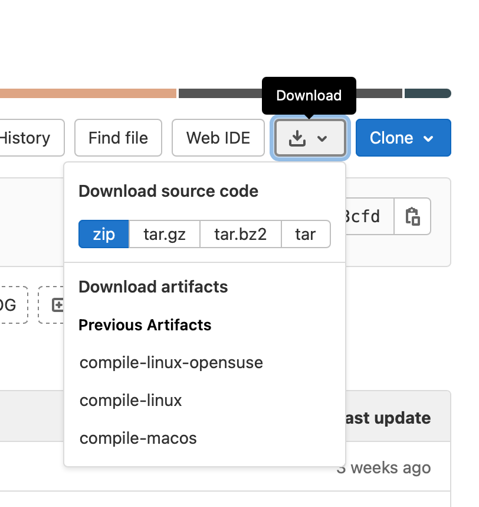

# WASI MPI
WASI MPI is a WebAssembly embedder for MPI applications based on Wasmer. It supports WebAssembly modules that comply
with the  WebAssembly System Interface (WASI) specification. In addition to WASI, functions from the Message Passing
Interface (MPI) specification can be used to enable distributed parallelization using WebAssembly.


## Installation
### Prebuilt Binaries
Every CI build of WASI MPI generates pre-built binaries for the following systems:
* Ubuntu 16.04 or later + OpenMPI 4.1.1 (compile-linux)
* OpenSUSE 15.1 + OpenMPI 4.0.4 (compile-linux-opensuse), this build is compatible with the execution environment on
  SuperMUC-NG
* MacOS Big Sur + OpenMPI 4.1.1 (compile-macos)

They can be downloaded on the top right of the page as shown below:



### Compilation from Source
#### Prerequisites
* Rust Compiler and Cargo
* pkg-config (On Ubuntu, install `pgk-config`)
* GCC with MPI compiler wrapper (On Ubuntu, install `build-essential` and `openmpi-bin`)
* OpenSSL, zlib1g and OpenMPI development libraries (On Ubuntu, install `libssl-dev`, `zlib1g-dev` and `libopenmpi-dev`)
* LLVM >= 11.0 (On Ubuntu, install `llvm-11`)

You can create a release build as follows:
```bash
cargo build --release
```
You might need to specify the location of the LLVM installation in the environment variable `LLVM_SYS_110_PREFIX`. You
can identify the installation directory of LLVM by using `which` and `ls`:

```bash
ls -la $(which llvm-11-config)
```

The two binaries `embedder` and `api` will be placed in the `./target/release/` directory.

## Usage
### Embedder
Execute WebAssembly modules by supplying the path to them as the first argument to the embedder, any arguments
following will be passed to the WebAssembly module verbatim:
```bash
./embedder my_module.wasm arg1 arg2
```
The embedder also supplies a help command:
```bash
embedder 0.1.0
Run WASI-MPI modules

USAGE:
    embedder [FLAGS] [OPTIONS] <MODULE_PATH> [--] [MODULE_ARGS]...

FLAGS:
    -h, --help       Prints help information
    -t, --timings
    -V, --version    Prints version information

OPTIONS:
    -c, --callback <callback>
    -d, --dir <dir>...

ARGS:
    <MODULE_PATH>
    <MODULE_ARGS>...
```

If you want to make use of the MPI functionality, you should run the embedder as an MPI job:
```bash
mpirun -np 8 ./embedder my_mpi_job.wasm
```

The embedder makes use of Wasmer's filesystem isolation. By default WebAssembly modules will not have access
to the host's filesystem. (Any file I/O will fail with access denied.) If your WebAssembly module requires
access to the host's filesystem you must explicitly grant it access to individual directories:
```bash
./embedder -d my_dir my_fs_module.wasm /my_dir
```
Paths given to the `-d` option are relative to your current working directory. Note that Wasmer employs path mapping
for the WebAssembly module, for instance in the previous example the directory `my_dir` was given as a relative path
but the argument to the WebAssembly module is an absolute path at the root of the filesystem. This is because any
directory that you give access for is mapped at the root of the WebAssembly module's filesystem.
You can give access to more than one directory:
```bash
./embedder -d dir1 -d dir2 -d dir3 my_fs_module.wasm /dir1 /dir2 /dir3
```

### Compiling C/C++ applications for use with WASI MPI
Refer to the documentation in [wasi-mpi-cpp-toolchain](../wasi-mpi-cpp-toolchain/README.md)

The `examples/` directory contains some prebuilt applications you may use to test your build of WASI MPI:
* Intel MPI Benchmarks (`imb.wasm`)
* HPCG Benchmark (`xhpcg.wasm`)
* NPB IS Benchmark (`npb-is-*-*.wasm`)
* NPB DT Benchmark (`npb-dt-*-*.wasm`)
* IOR Benchmark (`ior.wasm`)
